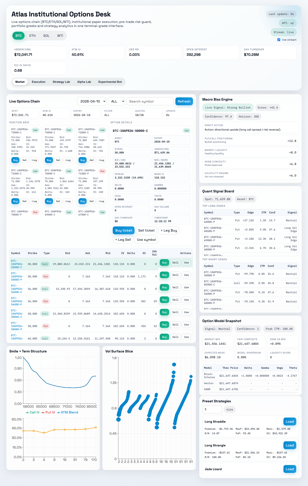
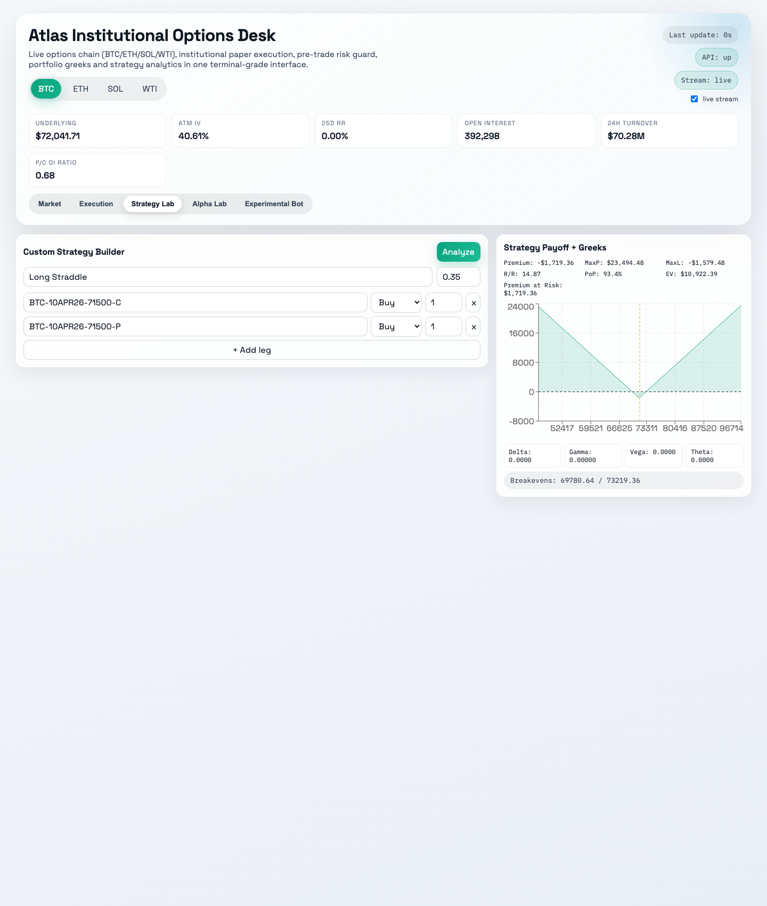
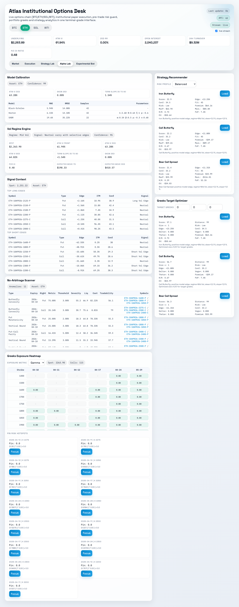
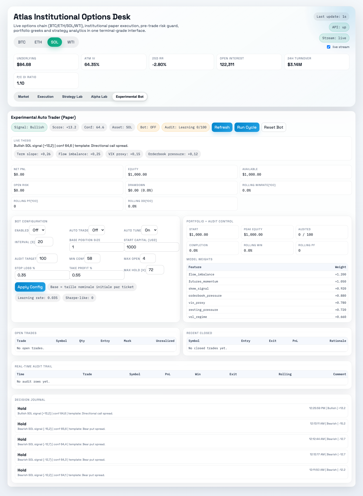
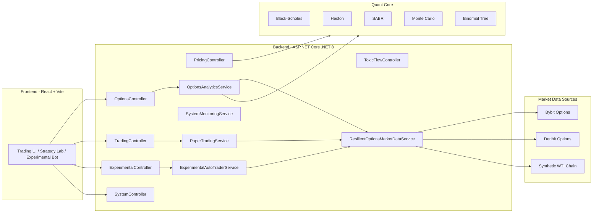
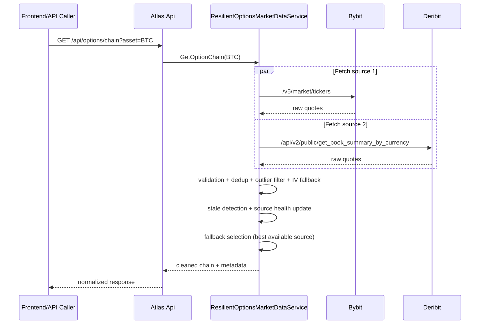
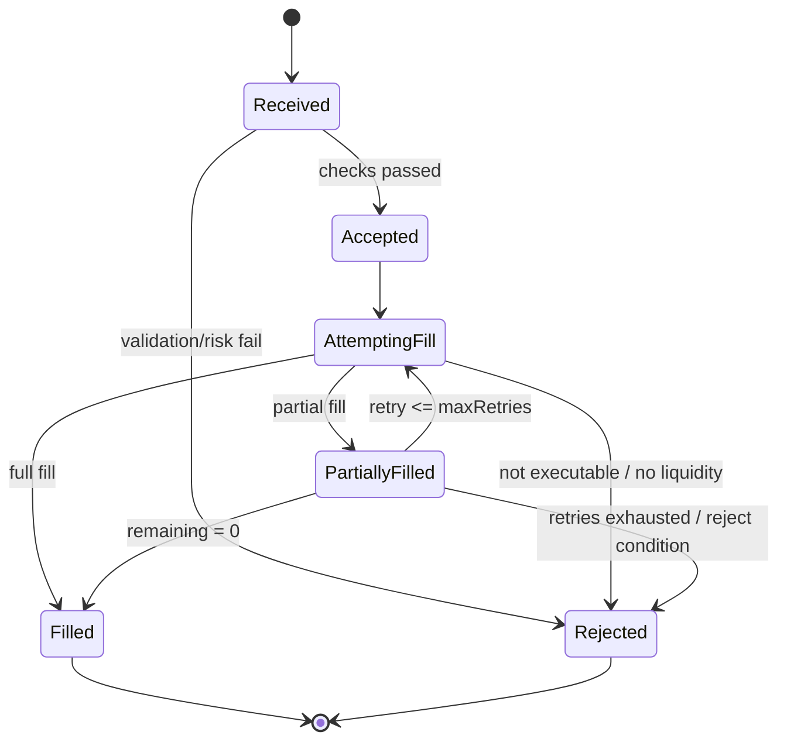
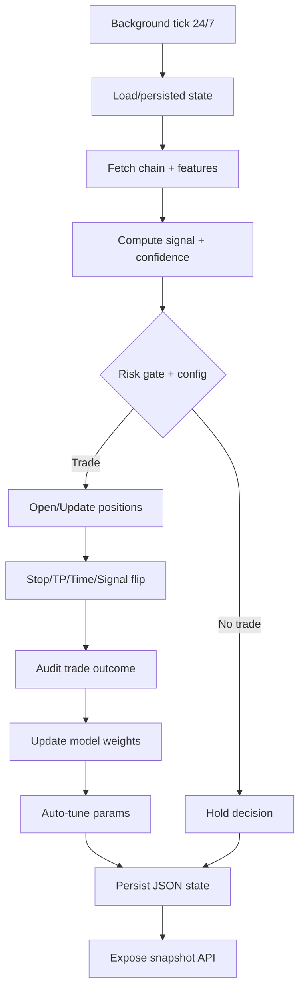
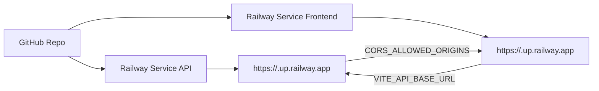

# Atlas — Institutional Crypto Options Desk

[](https://github.com/Kapriel-Talatinian/Atlas_public/actions/workflows/ci.yml)


Atlas est une plateforme **API + UI** pour un desk options crypto orienté execution/risk:
- analytics options (surface IV, Greeks, calibration, regime, macro/live bias),
- paper trading institutionnel (pré-trade risk, marge, slippage, QoE, idempotence, retries),
- market data résiliente multi-source (Bybit + Deribit + fallback WTI synthétique),
- OMS complet (cancel/replace/reconcile fills, algo TWAP/VWAP/POV, smart routing),
- persistance transactionnelle SQLite (ordre/position/risque/audit trail immuable),
- monitoring ops (health, metrics, alerts),
- monitoring SLO (availability + p95 latency) et playbooks de recovery,
- bot expérimental 24/7 en paper avec apprentissage online et audit continu.

> Statut produit: **simulation/paper trading uniquement** (pas d'envoi d'ordres réel exchange).

## Live Demo Status

- Web public Atlas: **à brancher sur un déploiement dédié**
- API publique Atlas: **à brancher sur un déploiement dédié**
- Note: les placeholders Railway génériques souvent utilisés (`atlas-web.up.railway.app`, `atlas-api.up.railway.app`) ne servent pas actuellement cette application, donc ils ne sont pas mis en avant ici pour éviter tout lien trompeur.

## Visual Walkthrough

Captures générées depuis l’application React locale avec les données live/synthétiques du repo.

Deep links utiles pour partager une vue précise:

- `/?tab=market&asset=BTC`
- `/?tab=strategy&asset=BTC&preset=first`
- `/?tab=alpha&asset=ETH`
- `/?tab=experimental&asset=SOL`

| Market Overview | Strategy Lab |
|---|---|
| [](docs/screenshots/market-overview.png) | [](docs/screenshots/strategy-lab.png) |

| Alpha Lab | Experimental Bot |
|---|---|
| [](docs/screenshots/alpha-lab.png) | [](docs/screenshots/experimental-bot.png) |

## Test Surface

Atlas expose aujourd’hui **29 tests backend xUnit** sur les briques qui comptent le plus pour la crédibilité quant/risk du projet:

- pricing et Greeks: Black-Scholes, IV solver, convergence Monte Carlo / binomial, stabilité numérique
- non-régression modèle: snapshots `BS / Heston / SABR`
- toxic flow: clustering et signaux de contrepartie
- observabilité: calcul SLO disponibilité / p95
- persistance: snapshots positions vers SQLite et relecture des événements

Fichiers de référence:

- [Tests.cs](tests/Atlas.Tests/Tests.cs)
- [ApiReliabilityTests.cs](tests/Atlas.Tests/ApiReliabilityTests.cs)

Commande rapide:

```bash
dotnet test Atlas.sln
```

## Design Rationale

Le projet mélange volontairement plusieurs niveaux de modèles au lieu de “choisir le plus sophistiqué partout”. **Heston** est conservé comme modèle structurel pour donner une lecture plus réaliste de la skew/convexité qu’un simple Black-Scholes, mais **Bates** n’a pas été retenu à ce stade car la calibration avec sauts apporte vite de l’instabilité et du sur-ajustement pour une desk app paper/live-demo. **SABR** reste utile à côté pour l’interpolation de smile et la lecture desk-friendly des ailes, donc Atlas expose les deux approches plutôt que d’en imposer une seule.

Sur l’OMS, l’idempotence est attachée au **`clientOrderId`** avant tout, pas à un hash brut du payload. La raison est simple: en vrai desk usage, un retry humain ou algo doit pouvoir représenter “le même ordre logique” même si certains champs secondaires changent entre deux tentatives. Le hash payload seul est trop fragile pour ce cas, alors que `clientOrderId` permet une sémantique d’ordre plus propre.

Enfin, la market data est construite sur **Bybit + Deribit + fallback synthétique**. Un seul provider aurait simplifié le code, mais aurait rendu impossible la comparaison inter-source, la détection de stale feed crédible et la continuité de service quand une API publique commence à répondre `403`, `404` ou vide. Le coût d’intégration multi-source est plus élevé, mais c’est précisément ce qui fait passer Atlas de “démo UI” à “desk simulator” cohérent.

## Quant Notes & Demo

Pour un lecteur quant, les deux points d’entrée les plus utiles sont maintenant:

- [QUANT_NOTES.md](QUANT_NOTES.md): choix de modèles, calibration, edge cases, limites connues, références papiers.
- [examples/pricing_demo.py](examples/pricing_demo.py): script de démonstration qui prend une option du chain Atlas, compare marché vs `BS / Heston / SABR`, affiche la calibration et une coupe de smile.

Commandes rapides:

```bash
dotnet run --project src/Atlas.Api
python3 examples/pricing_demo.py --asset BTC --right call
```

## 1) Vue d'ensemble

### 1.1 Architecture globale



### 1.2 Pipeline market data (résilient)



### 1.3 Cycle d'ordre (state machine)



### 1.4 Boucle du bot expérimental (autopilot)



## 2) Fonctionnalités clés

### 2.1 Options analytics
- Chain, expiries, surface IV, model comparison.
- Calibration, regime detection, live bias et macro bias.
- Recommandations de stratégies et optimizer Greeks.
- Arbitrage scan et exposure grid.

### 2.2 Exécution (paper trading)
- Pré-trade simulation: prix exécutable, slippage, frais, QoE.
- State machine robuste: retries, partial fills, state trace.
- Idempotence via `clientOrderId` + anti-duplicate fingerprint.
- OMS operations: cancel, replace, reconciliation des fills/orders.
- Algo execution: `TWAP`, `VWAP`, `POV`, slicing dynamique + routing multi-venue.
- Auto-hedging multi-legs avec exécution optionnelle.
- Risk engine pré-trade: notional, taille, Greeks, concentration, open orders, daily loss.
- Margin engine: initial/maintenance/equity/available margin/margin ratio.
- Kill-switch manuel + activation auto en cas de liquidation.

### 2.3 Market data pro
- Multi-source: Bybit + Deribit, fallback source.
- Détection stale feed et cache stale contrôlé.
- Pipeline nettoyage: invalids/outliers/dédoublonnage/normalisation.
- Source health par asset/source.

### 2.4 Monitoring / observabilité
- Metrics, counters, gauges, active alerts.
- Request observability middleware + latence/status HTTP.
- SLO report live (`availability`, `p95`) sur fenêtres 5m/1h.
- Endpoints ops dédiés (`/api/system/*`).

### 2.5 Persistance / audit trail
- Base transactionnelle SQLite (`TRADING_DB_PATH` configurable).
- Historique persistant des ordres, positions, snapshots de risque, et événements d’audit.
- Écriture append-only pour replay/reconciliation post-incident.

### 2.6 Experimental Bot
- Snapshot live: signal, trades, décisions, poids modèle.
- Persistance d'état sur disque (pas de reset au redémarrage).
- Rolling audit (100 trades par défaut): win-rate, profit factor, drawdown.
- Auto-tune optionnel des paramètres de trading.
- Capital de départ configurable (`startingCapitalUsd`, défaut 1000).

## 3) Stack technique

- Backend: `ASP.NET Core (.NET 8)`
- Frontend: `React 18`, `Vite`, `Recharts`
- Tests backend: `xUnit`
- Packaging API cloud: `Dockerfile.api`
- Déploiement recommandé: Railway (API + Frontend séparés)

## 4) Structure du repository

```text
atlas/
├── Atlas.sln
├── Dockerfile.api
├── railway.json
├── src/
│   ├── Atlas.Api/
│   │   ├── Controllers/
│   │   ├── Services/
│   │   ├── Middleware/
│   │   ├── Models/
│   │   └── Program.cs
│   ├── Atlas.Core/
│   ├── Atlas.Exchange/
│   └── Atlas.ToxicFlow/
├── frontend/
│   ├── src/
│   ├── package.json
│   └── railway.json
└── tests/
    └── Atlas.Tests/
```

## 5) Démarrage local

### 5.1 Prérequis
- `.NET SDK 8.x`
- `Node.js 18+`
- `npm`

### 5.2 Lancer l'API

Depuis la racine:

```bash
dotnet run --project src/Atlas.Api --urls http://127.0.0.1:5000
```

Swagger:
- `http://127.0.0.1:5000/swagger`

Health:
- `http://127.0.0.1:5000/health`

### 5.3 Lancer le frontend

```bash
cd frontend
npm install
npm run dev
```

UI:
- `http://127.0.0.1:5173`

Mode full stack local (API + UI en une commande):

```bash
cd frontend
npm run dev:full
```

## 6) Variables d'environnement

### 6.1 Backend (`src/Atlas.Api/.env.example`)

| Variable | Description | Exemple |
|---|---|---|
| `PORT` | Port runtime (injecté en cloud) | `5000` |
| `CORS_ALLOWED_ORIGINS` | Origines autorisées (CSV) | `http://127.0.0.1:5173` |
| `ASPNETCORE_ENVIRONMENT` | Environnement .NET | `Production` |
| `TRADING_DB_PATH` | Chemin DB SQLite ordres/risque/audit | `/data/atlas/trading.db` |
| `EXPERIMENTAL_BOT_STATE_DIR` | Répertoire persistance bot (optionnel) | `/data/atlas-bot` |

### 6.2 Frontend (`frontend/.env.example`)

| Variable | Description | Exemple |
|---|---|---|
| `VITE_API_BASE_URL` | URL API explicite | `http://127.0.0.1:5000` |
| `VITE_PROXY_TARGET` | Target proxy Vite local | `http://127.0.0.1:5000` |

## 7) Référence API

### 7.1 Pricing (`/api/pricing`)
- `GET /api/pricing/compare`
- `GET /api/pricing/greeks`
- `GET /api/pricing/implied-vol`

### 7.2 Toxic Flow (`/api/toxicflow`)
- `GET /api/toxicflow/dashboard`
- `GET /api/toxicflow/clusters`
- `GET /api/toxicflow/counterparties`
- `GET /api/toxicflow/alerts`
- `GET /api/toxicflow/counterparty/{id}`
- `GET /api/toxicflow/history`

### 7.3 Options (`/api/options`)
- `GET /api/options/assets?assets=BTC,ETH,SOL,WTI`
- `GET /api/options/expiries?asset=BTC`
- `GET /api/options/chain?asset=BTC&expiry=YYYY-MM-DD&type=all&limit=220`
- `GET /api/options/surface?asset=BTC&limit=600`
- `GET /api/options/models?symbol=...`
- `GET /api/options/calibration?asset=BTC&expiry=YYYY-MM-DD`
- `GET /api/options/signals?asset=BTC&expiry=YYYY-MM-DD&type=all&limit=140`
- `GET /api/options/regime?asset=BTC`
- `GET /api/options/macro-bias?asset=BTC&horizonDays=30&growthMomentum=0&inflationShock=0&policyTightening=0&usdStrength=0&liquidityStress=0&supplyShock=0&riskAversion=0`
- `GET /api/options/live-bias?asset=BTC&horizonDays=30`
- `GET /api/options/recommendations?asset=BTC&expiry=YYYY-MM-DD&size=1&riskProfile=balanced`
- `GET /api/options/optimizer?asset=BTC&expiry=YYYY-MM-DD&size=1&riskProfile=balanced&targetDelta=0&targetVega=0&targetTheta=0`
- `GET /api/options/exposure-grid?asset=BTC&maxExpiries=6&maxStrikes=24`
- `GET /api/options/arbitrage?asset=BTC&expiry=YYYY-MM-DD&limit=120`
- `GET /api/options/strategies/presets?asset=BTC&expiry=YYYY-MM-DD&size=1`
- `GET /api/options/stream?asset=BTC&expiry=YYYY-MM-DD&chainLimit=80` (SSE)
- `POST /api/options/strategies/analyze`

### 7.4 Trading (`/api/trading`)
- `GET /api/trading/limits`
- `GET /api/trading/margin-rules`
- `GET /api/trading/orders?limit=200`
- `GET /api/trading/notifications?limit=120`
- `POST /api/trading/orders/retry?maxOrders=25`
- `POST /api/trading/orders/cancel`
- `POST /api/trading/orders/replace`
- `GET /api/trading/orders/reconcile?limit=400`
- `GET /api/trading/killswitch`
- `POST /api/trading/killswitch`
- `GET /api/trading/positions`
- `GET /api/trading/risk`
- `GET /api/trading/book?orderLimit=150`
- `POST /api/trading/orders`
- `POST /api/trading/preview`
- `POST /api/trading/stress`
- `POST /api/trading/algo/execute`
- `POST /api/trading/hedge/suggest`
- `POST /api/trading/hedge/auto`
- `POST /api/trading/portfolio/optimize`
- `GET /api/trading/history?orderLimit=250&positionLimit=250&riskLimit=250&auditLimit=250`
- `POST /api/trading/reset`

### 7.5 Experimental Bot (`/api/experimental/bot`)
- `GET /api/experimental/bot/snapshot?asset=BTC`
- `GET /api/experimental/bot/explain?asset=BTC`
- `POST /api/experimental/bot/configure?asset=BTC`
- `POST /api/experimental/bot/run?asset=BTC&cycles=1`
- `POST /api/experimental/bot/reset?asset=BTC`

### 7.6 System / Ops (`/api/system`)
- `GET /api/system/health`
- `GET /api/system/metrics`
- `GET /api/system/alerts`
- `GET /api/system/slo`
- `GET /api/system/market-data`
- `GET /api/system/ops`
- `GET /api/system/recovery-playbook`
- `POST /api/system/recovery/execute?dryRun=false`
- `GET /health`

## 8) Exemples payloads

### 8.1 `POST /api/trading/orders`

```json
{
  "symbol": "ETH-10MAR26-1700-C",
  "side": "Buy",
  "quantity": 2,
  "type": "Market",
  "limitPrice": null,
  "clientOrderId": "ORDER-001",
  "maxRetries": 3,
  "allowPartialFill": true,
  "maxSlippagePct": 0.08
}
```

### 8.2 `POST /api/trading/killswitch`

```json
{
  "isActive": true,
  "reason": "manual-risk-lock",
  "updatedBy": "desk"
}
```

## 9) Exemples curl

```bash
# Health
curl -s http://127.0.0.1:5000/health

# Ops snapshot
curl -s http://127.0.0.1:5000/api/system/ops

# Option chain ETH
curl -s "http://127.0.0.1:5000/api/options/chain?asset=ETH&limit=80"

# Preview ordre
curl -s -X POST http://127.0.0.1:5000/api/trading/preview \
  -H 'Content-Type: application/json' \
  -d '{"symbol":"ETH-10MAR26-1700-C","side":"Buy","quantity":1,"type":"Market"}'

# Bot snapshot
curl -s "http://127.0.0.1:5000/api/experimental/bot/snapshot?asset=BTC"
```

## 10) Qualité et tests

```bash
# Build backend
dotnet build Atlas.sln -c Release

# Tests backend
dotnet test Atlas.sln

# Build frontend
cd frontend
npm run build
```

Résumé visible pour un lecteur technique:

- `29` tests passent actuellement en local et en CI
- pricing: `Black-Scholes`, `ImpliedVolSolver`, `MonteCarlo`, `BinomialTree`
- cohérence mathématique: Greeks analytiques vs finite-difference
- non-régression: snapshots `BS/Heston/SABR`
- fiabilité plateforme: `SLO monitoring`, persistance SQLite des positions

## 11) Déploiement Railway (sans VPS)

Architecture recommandée: **2 services** (API + Frontend).



### 11.1 Service API
- Root directory: `/`
- Config: [`railway.json`](railway.json)
- Build: `Dockerfile.api`

### 11.2 Service Frontend
- Root directory: `frontend`
- Config: [`frontend/railway.json`](frontend/railway.json)

### 11.3 Étapes
1. Connecter le repo à Railway.
2. Créer le service API (`/`).
3. Déployer et récupérer l'URL API.
4. Créer le service Frontend (`frontend`).
5. Définir `VITE_API_BASE_URL=https://<api-url>` côté Frontend.
6. Définir `CORS_ALLOWED_ORIGINS=https://<frontend-url>` côté API.
7. Redéployer les deux services.

## 12) Troubleshooting

### 12.1 `Failed to fetch` / `ECONNREFUSED 127.0.0.1:5000`
- Vérifier que l'API tourne sur le port attendu.
- Vérifier `VITE_API_BASE_URL` / `VITE_PROXY_TARGET`.
- Redémarrer API puis frontend.

### 12.2 `unknown symbol ...` sur WTI
- La chaîne WTI est synthétique et peut changer de strike entre deux refresh.
- Le moteur fait une résolution canonique + nearest strike fallback, mais rafraîchir la chain avant envoi reste recommandé.

### 12.3 Swagger indisponible
- Vérifier `http://127.0.0.1:5000/swagger`.
- Vérifier que le backend a bien démarré sans erreur (`dotnet run --project src/Atlas.Api`).

### 12.4 Railway build error
- API doit être construite depuis la racine repo (`/`) car `Atlas.Api` dépend de `Atlas.Core/Exchange/ToxicFlow`.

### 12.5 Erreurs 403 Bybit/Deribit en cloud
- Les endpoints utilisés sont publics: **aucune clé API n'est nécessaire** pour cette version.
- Un 403 peut venir d'un blocage egress/rate-limit côté provider.
- Atlas applique un fallback synthétique pour maintenir les endpoints fonctionnels (notamment SOL/WTI) au lieu de renvoyer un crash API.

## 13) Passage production réel (checklist)

- AuthN/AuthZ (JWT/OIDC, RBAC).
- Secret management (KMS/Vault).
- Persistance DB (orders/fills/positions/audits/metrics).
- Observabilité externe (OpenTelemetry + Prometheus/Grafana + alerting).
- Runbooks d'incident + on-call.
- Connecteurs execution réelle exchange + reconciliations.

Runbooks inclus:
- `docs/runbooks/incident-recovery.md`
- `docs/runbooks/slo-breach.md`
- `docs/runbooks/deploy-zero-downtime.md`

## 14) Limites actuelles

- Trading réel non activé (paper only).
- Pas de multi-tenancy utilisateur complet.
- Bot expérimental = recherche/itération, pas promesse de performance live.
- Le périmètre actuel est infrastructurel et métier — l'objectif n'est pas de battre un pricer production mais de démontrer une capacité à construire une plateforme options cohérente. Les modèles de pricing sont implémentés à un niveau académique (références : Gatheral, Hagan et al.), pas optimisés pour la production.

## 15) Licence

Licence propriétaire avec fichier explicite à la racine:

- [LICENSE](LICENSE)
