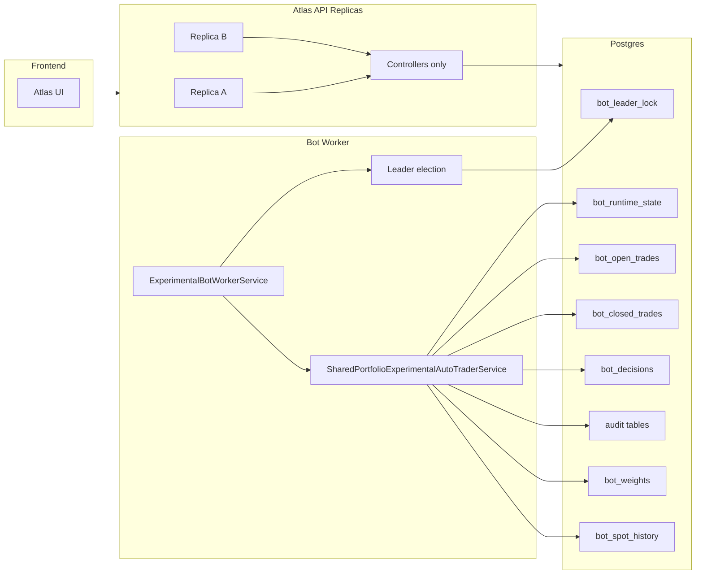

# Atlas War-Machine Sprint 1

## Goal

Sprint 1 turns Atlas from a strong single-process prototype into a production-safe desk service.

The hard requirement is simple:

- one and only one bot worker is allowed to trade at a time
- bot state must survive restarts
- API replicas must remain stateless for bot-critical logic
- the portfolio, audits, decisions, and neural signals must be recoverable after crash or deploy

Current Atlas is strong on analytics and signal generation, but the runtime is still vulnerable to split-brain because the autopilot state is held in-process and persisted to local disk via `shared-portfolio.json`.

With Railway or any multi-replica deployment, that is not safe enough for a live system.

## Current State In Repo

Relevant current files:

- [`Program.cs`](/Users/kapriel.talatinian/Desktop/atlas/src/Atlas.Api/Program.cs)
- [`ExperimentalBotWorkerService.cs`](/Users/kapriel.talatinian/Desktop/atlas/src/Atlas.Api/Services/ExperimentalBotWorkerService.cs)
- [`SharedPortfolioExperimentalAutoTraderService.cs`](/Users/kapriel.talatinian/Desktop/atlas/src/Atlas.Api/Services/SharedPortfolioExperimentalAutoTraderService.cs)
- [`ExperimentalController.cs`](/Users/kapriel.talatinian/Desktop/atlas/src/Atlas.Api/Controllers/ExperimentalController.cs)
- [`ExperimentalRuntimeController.cs`](/Users/kapriel.talatinian/Desktop/atlas/src/Atlas.Api/Controllers/ExperimentalRuntimeController.cs)
- [`TradingPersistenceService.cs`](/Users/kapriel.talatinian/Desktop/atlas/src/Atlas.Api/Services/TradingPersistenceService.cs)

Current behavior:

- bot runtime loop is isolated in `ExperimentalBotWorkerService`
- bot state is persisted through `IBotStateRepository` (`file` fallback or Postgres)
- OMS/risk/audit persistence is SQLite-backed
- API role snapshots reload persisted runtime state instead of driving the loop

Current risks:

- two replicas can run the bot loop simultaneously
- each replica can have a different local filesystem state
- a restart can change leader implicitly without fencing
- runtime state and order/risk persistence are split across different local stores

## Sprint 1 Deliverables

Sprint 1 should ship these concrete outcomes:

1. Postgres-backed bot runtime state
2. lease-based leader election with fencing token
3. dedicated bot worker role
4. recovery-on-start for open trades and decision state
5. bot runtime health endpoints
6. replica-safe deployment model

## Architecture Target

## Runtime Roles

Introduce explicit runtime roles:

- `api`: serves HTTP, never runs the trading loop
- `bot-worker`: runs the autopilot loop, acquires lock, persists state
- `all`: local-dev mode only

Environment variable:

- `ATLAS_RUNTIME_ROLE=api|bot-worker|all`

Behavior:

- local dev default: `all`
- Railway API service: `api`
- Railway worker service: `bot-worker`

## Files To Add

### 1. Bot runtime persistence

Add:

- `src/Atlas.Api/Services/IBotStateRepository.cs`
- `src/Atlas.Api/Services/PostgresBotStateRepository.cs`
- `src/Atlas.Api/Models/BotRuntimePersistenceDtos.cs`

Repository responsibilities:

- load full runtime snapshot
- upsert portfolio state atomically
- append decisions
- append audits
- append or reconcile open trades
- archive closed trades
- store neural signals per cycle
- store weights
- store spot history slices

### 2. Leader election

Add:

- `src/Atlas.Api/Services/IBotLeaderElectionService.cs`
- `src/Atlas.Api/Services/PostgresBotLeaderElectionService.cs`

Responsibilities:

- acquire lease for `bot_key=MULTI`
- renew lease heartbeat
- release lease on shutdown when possible
- issue monotonically increasing fencing token
- expose current owner/lease state

### 3. Worker runtime

Add:

- `src/Atlas.Api/Services/ExperimentalBotWorkerService.cs`

Responsibilities:

- run only when role is `bot-worker` or `all`
- acquire leadership before running cycle
- renew leadership during runtime
- skip cycle if lease is lost
- publish health metrics
- recover state before first cycle

### 4. Runtime health surface

Add:

- `src/Atlas.Api/Models/BotRuntimeDtos.cs`
- `src/Atlas.Api/Controllers/ExperimentalRuntimeController.cs`

Endpoints:

- `GET /api/experimental/runtime`
- `GET /api/experimental/runtime/leader`
- `GET /api/experimental/runtime/health`

## Files To Change

### [`Program.cs`](/Users/kapriel.talatinian/Desktop/atlas/src/Atlas.Api/Program.cs)

Refactor service wiring:

- keep `SharedPortfolioExperimentalAutoTraderService`
- inject repository + leader election service
- register `ExperimentalBotWorkerService` instead of always-on generic hosted bot
- add role-based conditional hosted service registration
- add Postgres connection config

Target wiring:

- `IBotStateRepository -> PostgresBotStateRepository`
- `IBotLeaderElectionService -> PostgresBotLeaderElectionService`
- `IExperimentalAutoTraderService -> SharedPortfolioExperimentalAutoTraderService`
- `HostedService -> ExperimentalBotWorkerService` only if role allows

### [`SharedPortfolioExperimentalAutoTraderService.cs`](/Users/kapriel.talatinian/Desktop/atlas/src/Atlas.Api/Services/SharedPortfolioExperimentalAutoTraderService.cs)

Refactor responsibilities:

Keep:

- signal generation
- trade ranking
- lifecycle management
- learning logic
- snapshot assembly

Remove from service:

- local JSON file authority
- local disk runtime persistence
- implicit singleton assumptions

Add to service:

- `LoadStateAsync()` from repository
- `PersistCycleAsync()` to repository
- version/fencing-aware save
- reconciliation hooks on startup

### Legacy hosted bot loop

The old always-on `ExperimentalBotHostedService` is removed.

The runtime loop now lives only in [`ExperimentalBotWorkerService.cs`](/Users/kapriel.talatinian/Desktop/atlas/src/Atlas.Api/Services/ExperimentalBotWorkerService.cs).

### [`ExperimentalController.cs`](/Users/kapriel.talatinian/Desktop/atlas/src/Atlas.Api/Controllers/ExperimentalController.cs)

Keep current endpoints for snapshot/explain/run/reset.

Adjust behavior:

- `run/reset/configure` should hit repository-backed state
- `run` in production may be admin-only or worker-only behind flag
- `snapshot` should be fully read-only against persisted runtime state

### [`TradingPersistenceService.cs`](/Users/kapriel.talatinian/Desktop/atlas/src/Atlas.Api/Services/TradingPersistenceService.cs)

Do not delete in sprint 1.

Instead:

- keep SQLite OMS persistence working for now
- document that sprint 2 should migrate OMS/risk/audit to Postgres as well
- optionally introduce provider abstraction so bot runtime and OMS persistence can converge later

## Exact Implementation Sequence

### Step 1. Add Postgres runtime schema

Use [`postgres-bot-runtime.sql`](/Users/kapriel.talatinian/Desktop/atlas/docs/sql/postgres-bot-runtime.sql).

Deliverable:

- schema applied in Railway Postgres
- tables indexed and ready

### Step 2. Add repository layer

Implement `IBotStateRepository` with methods:

- `Task<BotRuntimeAggregate?> GetAsync(string botKey, CancellationToken ct)`
- `Task InitializeAsync(string botKey, ExperimentalBotConfig config, CancellationToken ct)`
- `Task SaveCycleAsync(BotRuntimeAggregate aggregate, long fencingToken, CancellationToken ct)`
- `Task MarkTradeClosedAsync(string botKey, string tradeId, string exitReason, CancellationToken ct)`
- `Task<BotRuntimeLeaderSnapshot?> GetLeaderSnapshotAsync(string botKey, CancellationToken ct)`

Save semantics:

- cycle save must be transactional
- write `runtime_state`, `weights`, `spot_history`, `signals`, `open_trades`, `closed_trades`, `decisions`, `audits` together
- stale writer must fail if fencing token is outdated

### Step 3. Add leader election

Implement lease model:

- lease owner key: `MULTI`
- lease duration: `15s`
- heartbeat renewal: `5s`
- expiry grace: `2x heartbeat`

Rules:

- only holder of valid lease can run trading cycle
- every successful acquisition increments fencing token
- repository writes require matching fencing token

### Step 4. Add worker service

Worker loop:

1. load config and state
2. attempt lease acquisition
3. if leader, run one cycle
4. persist cycle
5. renew heartbeat
6. if lease lost, stop trading immediately

### Step 5. Add recovery

Recovery logic on worker startup:

- load persisted open trades
- recompute marks using fresh quotes
- repair `last_signal`
- restore `neural_signals`
- refresh drawdown anchors
- continue from persisted weights

### Step 6. Add runtime endpoints

Need operational visibility:

- current role
- current leader instance id
- current fencing token
- lease expiry
- last cycle status
- last cycle duration
- last persistence success
- open trades count

### Step 7. Deployment split

Railway target layout:

- service `atlas-api`
  - role `api`
  - 1 or more replicas allowed
- service `atlas-bot-worker`
  - role `bot-worker`
  - exactly 1 replica preferred
- service `postgres`

## Acceptance Criteria

Sprint 1 is done only if all of the following are true:

- two API replicas can run without duplicate bot cycles
- worker restart preserves bot state and open trades
- deploy restart does not erase `weights`, `audits`, or `decisions`
- only lease holder can save cycle state
- stale worker cannot overwrite state after lease loss
- snapshot endpoint remains available even if worker is restarting
- manual smoke test on Railway shows single leader and stable book

## Tests Required

Add tests in `tests/Atlas.Tests`:

- leader lease acquisition succeeds for first worker
- second worker cannot acquire active lease
- lease expiry allows takeover
- stale fencing token write is rejected
- restart recovery rebuilds open trade state
- snapshot reads persisted neural signals
- no duplicate trade when worker restarts mid-cycle

## Scope Cuts

Do not include in sprint 1:

- full OMS migration to Postgres
- multi-venue execution router
- smart routing
- model training pipeline
- frontend redesign
- live exchange execution

Sprint 1 is operational hardening only.

## Why This Sprint Has Highest ROI

Without this sprint, every additional feature sits on a runtime that can duplicate decisions under multi-replica deployment.

With this sprint complete:

- Atlas becomes replica-safe
- deploys stop being dangerous
- the bot becomes restart-tolerant
- the next features can assume stable state and ownership

That is the prerequisite for everything else.
